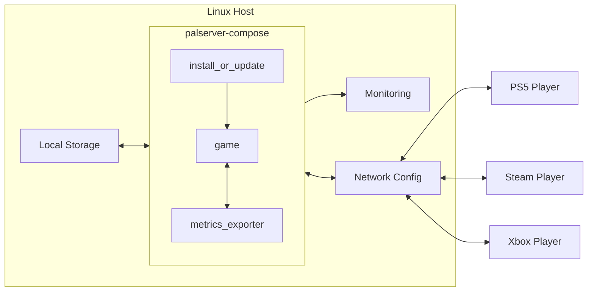

# About

A fan-made hobby project, not officially associated with Palworld or Pocketpair.

The services implemented in this [Docker Compose](https://docs.docker.com/compose/) project will install, run, and expose metrics from a dedicated multiplayer server for [Palworld](https://www.pocketpair.jp/en/games-en/palworld-en/).

**Use case**: a system administrator with a few friends who want to play Palworld together, in a private game world, without requiring a specific player to always be online.

(Contrasted with Palworld's "co-op multiplayer" mode, which hosts a server in one player's game client, thus requiring that player to be online to run the server.)

Goals of this project:

- Enable rapid setup of a new game server from scratch.

- Provide the sysadmin with convenient workflows for starting and stopping the game server at will.

  - Include automatically installing Palworld game updates before the server starts.

- Allow the sysadmin to easily configure or reconfigure the game server's resource constraints and runtime settings.

- Support high-level performance profiling, by monitoring game server operations alongside key usage metrics.

# Quick start

*QUICK requirements*: the server host must have `docker` and `docker compose`; and must be able to receive data from players on **UDP port 8211**. If for example, your host is on a home network behind a typical router, the router's firewall should forward 8211/UDP from the internet to that host.

1. `git clone` this repository.

2. Configure your game server.

   a. `cd` into the checkout folder, and create a `.env` file based on the repository's example; `cp example-dotenv.env .env` to get started.

   b. Edit the `SERVER_NAME` to something you and your friends will recognize.

   c. Store an Admin Password (for game server APIs and admin commands) like: `echo MyAdminPassword > ./admin_password`

   d. Store a Server Password (for players to join the game server) like: `echo MyServerPassword > ./server_password`

3. Start the server.

   - For a quick, attended startup session: `docker compose up --yes --build --pull=always --force-recreate`

     - This command attaches your interactive terminal to the game server and related services. Hit `CTRL+C` to stop the server.

   - *SUGGESTED* To enable `systemctl` start/stop/restart, install a service file based on the repository's example; `cp example-palserver.service /etc/systemd/system/palserver.service` to get started.

     a. Modify the `WorkingDirectory` in that service file to match your checkout folder.

     b. Then `systemctl daemon-reload` and `systemctl start palserver` to start the game server as a background process.

     c. To stop the server later, `systemctl stop palserver`

4. Play. :)

   - In the Palworld game client, *Join Multiplayer Game* and then go to the *Community Servers* list. Search for the `SERVER_NAME` you configured earlier, then enter your Server Password when prompted.

   - Players on PC can also join your game server by entering its internet-facing IP address and port `:8211` in the server browser. *(This text entry option isn't available to console players.)*

# System requirements

## Docker

This project recommends consulting [Docker's own install documentation](https://docs.docker.com/engine/install/) to get relatively up-to-date versions of `docker` and `docker-compose` for your host system.

## CPU and memory

[Pocketpair's documentation](https://docs.palworldgame.com/getting-started/requirements) recommends 4 CPU cores and 16 GB of memory; these specifications could be considerably more than you need, depending on player count.

This project recommends:

- CPU: reserve 2 cores, limit to 4.

- Memory: reserve 8 GB, limit to 16.

These CPU and memory values are set in `docker-compose.yml` within the `game` service's `deploy.resources` section. To adjust these values for your system, edit the `.yml` file directly.

A container metrics-extraction tool such as [cAdvisor](https://github.com/google/cadvisor) is strongly recommended for monitoring the game server container's actual CPU and memory usage.

This project also runs a `metrics_exporter` service alongside the game server; the metrics exporter service's resource requirements are trivial in comparison to the game server.

## Network

Palworld gameplay, allowing players to connect to the game server, requires an open UDP port: port 8211 by default.

- If necessary, this port assignment can be reconfigured in Palworld's settings file (see the Configuration section for more information).

- This project's `docker-compose.yml` exposes `8211/udp` to all host interfaces by default. To change this port and/or the bound network interfaces, edit the `.yml` file directly.

- Your host firewall settings may or may not require additional configuration to allow communication on this port. Firewall configuration is outside the scope of this documentation.

The Palworld game server's [REST API](https://docs.palworldgame.com/category/rest-api) is used by this project, but limited to the `docker compose` internal network by default. This project assumes that other processes and/or external entities don't require access to the Palworld REST API.

# Configuration

**NOTE**: Game server settings are applied when the server starts up. To change a setting, you must stop the server, modify configuration files, then restart the server.

Palworld server settings, as [documented by Pocketpair online](https://docs.palworldgame.com/settings-and-operation/configuration/), are mostly stored in a text file in the server's installation directory. Using this project's default configuration and game-install location, the file will be located at:

`<checkout>/palserver-data/Pal/Saved/Config/LinuxServer/PalWorldSettings.ini`

- This project's game server container will create that `.ini` file, based on default settings, the first time it starts up the game server.

- The `.env` template used by this project *overrides* a limited subset of those settings:

  - `SERVER_NAME` overrides the settings file's `ServerName`

  - `SERVER_DESCRIPTION` overrides the settings file's `ServerDescription`

  - The contents of `ADMIN_PASSWORD_FILE` override the settings file's `AdminPassword`

  - The contents of `SERVER_PASSWORD_FILE` override the settings file's `ServerPassword`

To change other settings, edit the `.ini` file directly.

## Note about command-line arguments

A few Palworld server settings are not made in the `.ini` file described above, but in [command-line arguments to the server process](https://docs.palworldgame.com/settings-and-operation/arguments). This project encodes (or avoids) most of these settings arbitrarily in `palserver-container/` helper scripts. Adding to or modifying those settings is left as an exercise for the sysadmin.

One exception is the `-publiclobby` argument: when applied, a Palworld server will register its name and connection parameters with Pocketpair's list of Community Servers. **This project applies `-publiclobby` by default**. A sysadmin can change this by editing `docker-compose.yml` directly, modifying the `game` service's `PUBLIC_LOBBY` environment variable.

- The list of Community Servers is public, and exposes your server's name, connection info, and number of connected players to every other Palworld player. (Joining the server still requires your secret ServerPassword.)

- But *this exposure is necessary for console players*, because they are unable to join a game server by IP address or hostname. Console players can only join servers in the Community Server list.

## Performance tuning

The Palworld server process is expected to consume CPU and memory in proportion to the number of simulating [in-game actors](https://dev.epicgames.com/documentation/unreal-engine/actors-in-unreal-engine), which in turn scales with:

- The number of players connected at any time; pals and NPCs near a player's current location will be simulated in real-time.

- The number of established base camps; worker pals assigned to a base will always be simulating.

A server's maximum number of simultaneous players is the most important scaling factor to consider. While the number of base camps (gradually unlocked through "base level" missions) is also significant, default game settings result in a relatively low amount of bases.

Consult [Pocketpair's documentation regarding performance-related configuration](https://docs.palworldgame.com/settings-and-operation/configuration#performances) for more information on how you can constrain (or grow) the resource needs of your game server.

Older versions of Palworld, when the game was in Early Access, suggested particular [command-line options](https://docs.palworldgame.com/settings-and-operation/arguments) for tuning multi-threaded performance on a dedicated server. Per the Pocketpair documentation, these options are now deprecated; in version 1.0 and later, **the Palworld server process manages multiple worker threads automatically** without these options.

## Gameplay settings

In general, the meaning and impact of Palworld gameplay settings is beyond the scope of this documentation. Consult [Pocketpair's configuration documents](https://docs.palworldgame.com/settings-and-operation/configuration/) for information on gameplay settings which might be interesting for you.

If you intend to leave the game server running with no players online (i.e. leave base pals working unattended), consider changing the `bEnableInvaderEnemy` setting to `False` to disable random base-invasion attacks.

# Server updates

Pocketpair will occasionally update Palworld, publishing new versions of its game clients and game server. Players are assumed to receive these updates to their game clients automatically, through their chosen game platform.

This project's `install_or_update` service will check for, and install, game server updates automatically; but services must be restarted (stopping an active game server) to perform the check.

If the project has been installed as a `systemd` service unit, the sysadmin can simply `systemctl restart palserver` to begin the automatic update process.

Note that the stop/restart will eject currently-connected players, so sysadmins should probably notify players of the expected outage.

# Server monitoring

This project includes a `metrics_exporter` service which enables collecting Palworld server metrics in [Prometheus](https://prometheus.io).

The project's `docker-compose.yml` exposes metrics on `8213/tcp` to all host interfaces by default. To change this port and/or the bound network interfaces, edit the `.yml` file directly.

By collecting those metrics with Prometheus, a sysadmin can use tools such as [Grafana](https://grafana.com) to monitor game server performance and player usage in real-time, and analyze those metrics' history.

**SCREENSHOT TO-DO**

Refer to [the exporter project](https://github.com/tsuereth/palserver-metrics-exporter) for more details and usage examples.

A sysadmin should also collect host resource metrics - including CPU, memory, network, and disk usage - to monitor and analyze host resources alongside game server activity. Many instrumentation tools like [cAdvisor](https://github.com/google/cadvisor) and [Node Exporter](https://github.com/prometheus/node_exporter) can help with this.

Finally, although typical monitoring discipline will also include service logs, the Palworld game server's log events are not particularly insightful. (In fact, game server log messages acknowledging `metrics_exporter`'s API requests are likely to constitute the bulk of its log volume.) This project makes no particular recommendation regarding log collection.

# Save data management

The Palworld server writes save data - including configuration settings, the state of the game world, and progress of players in it - to files within the game installation directory: `<install-dir>/Pal/Saved/...`

When this project updates a Palworld server installation, the update is not expected to tamper with any existing save data. Nevertheless, sysadmins are encouraged to perform some kind of regular backup procedure *just in case*. (This project does not have any built-in mechanism for externally backing up save data.)

Palworld's default settings include `bIsUseBackupSaveData=True` which causes the game server to regularly create backup snapshots, still inside the installation directory, of world and player save data. Pocketpair's [documentation describes the schedule of these snapshots](https://docs.palworldgame.com/settings-and-operation/configuration#about-bisusebackupsavedata). These backups can be a helpful safeguard in case of an unwanted change (like deleting a base by accident) or unexpected data corruption; they may also make host-side backups more onerous due to the number of files they create.

# Component detail

The `docker-compose.yml` file in this project defines multiple components which interoperate to prepare and run the Palworld game server.

- A volume `palserver-installdir` is configured to map to local storage on the host system. The Palworld game server is installed to this volume, and the game server records configuration and save data files inside it.

- Two secrets `admin_password` and `server_password` are configured to map to local files on the host system. Services will mount those files to reference the game server's AdminPassword and ServerPassword, so these credentials' plaintext values can be kept secret from other configuration files.

- Some additional non-secret variables for server configuration are read from the local `.env` file.

- The project's runtime lifecycle is implemented in multiple service containers:

  - `install_or_update` performs first-time Palworld server installation *or* updates an existing installation.

  - `game` applies configuration overrides and runs the game server itself.

  - `metrics_exporter` regularly requests metrics from the game server and exports them for Prometheus collection.

```mermaid
sequenceDiagram
  participant installdir@{"alias":"palserver-installdir volume","type":"collections"}
  participant configvars@{"alias":"secrets and .env variables","type":"collections"}
  participant installorupdate@{"alias":"install_or_update service","type":"control"}
  box game service
    participant configmanager@{"alias":"PalServerConfigManager application","type":"control"}
    participant palserver@{"alias":"PalServer application","type":"control"}
  end
  participant metrics@{"alias":"metrics_exporter service","type":"control"}

  installorupdate ->> installdir: SteamCMD Install/Update/Validate
  installorupdate ->> installorupdate: Done
  configvars ->> configmanager: Read Settings
  configmanager ->> installdir: Write PalWorldSettings.ini
  configmanager ->> configmanager: Done
  loop Until Stopped
    installdir <<->> palserver: Run Game Server
  end
  loop Until Stopped
    metrics ->> palserver: API Requests
  end
```

## install_or_update

The `install_or_update` service uses a container image defined outside this project: [steamcmd-install-app](https://github.com/tsuereth/steamcmd-install-app).

This container leverages [SteamCMD](https://developer.valvesoftware.com/wiki/SteamCMD) to manage the installation of Palworld's dedicated server application, using that application's Steam App ID.

After validating the app installation (or failing to do so), this container exits with an appropriate status code.

## game

The `game` service builds and runs a container using source code within this project. This service doesn't start until/unless the `install_or_update` service has completed successfully.

A multi-stage `Dockerfile` is used to separate the container's build dependencies, based on a `dotnet/sdk` image, and runtime dependencies, based on an `ubuntu` image.

- The first stage builds a .NET application, `PalServerConfigManager`, which is then deployed into the second stage.

- The second stage executes an entrypoint script to create and/or switch to a non-root user appropriate for running the `PalServer` application; then executes the `PalServerConfigManager` to prepare the game server's configuration settings; then executes the `PalServer` application itself.

## metrics_exporter

The `metrics_exporter` service uses a container image defined outside this project: [palserver-metrics-exporter](https://github.com/tsuereth/palserver-metrics-exporter). This service doesn't start until the `game` service appears healthy, by checking the game server's REST API.

This container runs a .NET application, `PalServerMetricsExporter`, to periodically request metrics and other metadata from the game server's REST API. The application also runs an HTTP listener for Prometheus scrape requests, so that an external Prometheus service can collect those game server metrics.

# Appendix: save data migration

Development of this project began with a game world that was once a Palworld "co-op multiplayer" server. **Migrating a player's locally-saved game world to a dedicated server is possible**, although some migration steps are not straightforward.

*As a trivial example: a Windows-hosted server will save configuration settings in `<install-dir>/Pal/Saved/Config/WindowsServer/...` while a Linux-hosted server uses `<install-dir>/Pal/Saved/Config/LinuxServer/...` instead.*

In general, the structure of Palworld save data is outside the scope of this documentation; this document merely highlights why data-migration tools may be needed. Other resources regarding Palworld save management are available from the player community online, such as in [Steam user discussions](https://steamcommunity.com/app/1623730/discussions/) and in [other GitHub projects](https://github.com/topics/palworld).

Notably, one key concept when managing Palworld save data is the Player ID. A game world's records of player ownership, and each player's saved character progress in that world, are keyed by an ID which is based on two components:

1. That player's online account platform *i.e.* how they've logged into online presence services (PlayStation Network, Steam, Xbox Network).

2. A unique identifier for that player from the online platform *i.e.* a PlayStation ID or a Steam ID or an Xbox ID.

*In theory* this means that a player should have the same Palworld Player ID in any game world. However, that isn't always true in practice.

- When a player hosts a "co-op" server, their own Player ID in that server's save data is always `1`. Migrating that save data to a dedicated server will need to replace this Player ID with the player's real effective online platform ID.

- Online platform-provided IDs *may* vary unexpectedly depending on context. For example, an Xbox player will appear under one ID on a "co-op" server but a different ID on a dedicated server. This context-dependent ID might not be known until a player connects to the server for the first time.

(Other player-specific save data modifications may exist unknown to this project.)

Thus, "moving" a game world from one server type to another *will* require some amount of adapting save data to Player ID changes. Be sure to make frequent backups of `Pal/Saved/...` when attempting to modify it for a server migration.
